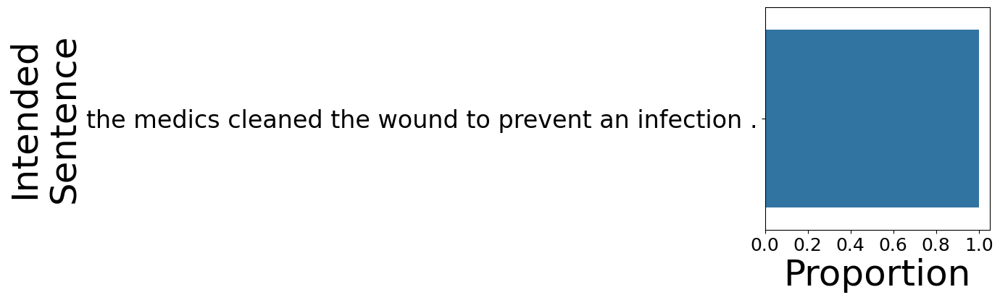
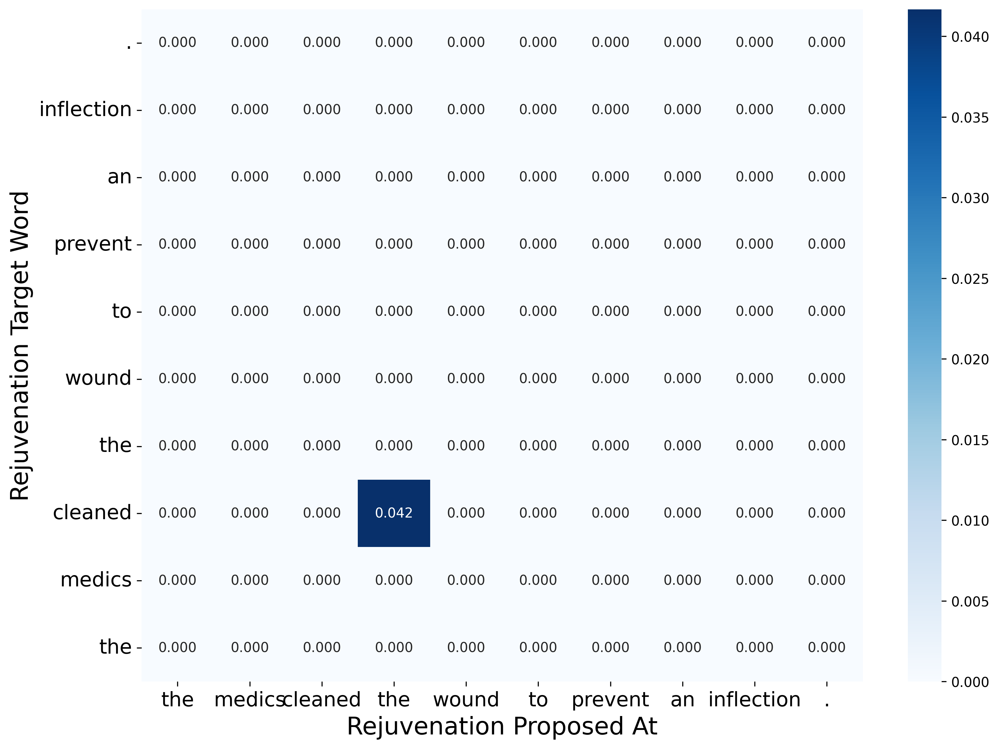
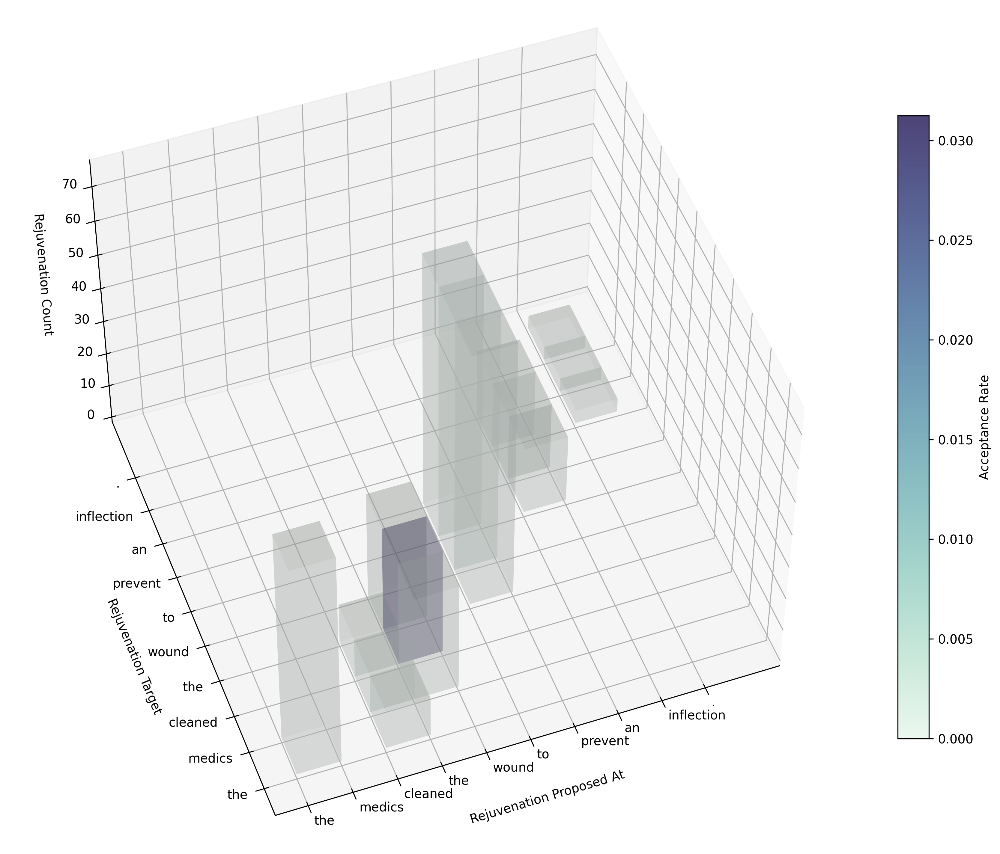

# Incremental and Approximate Noisy Channel Inference in Gen.jl

## Dependencies

Install Gen.jl: https://github.com/probcomp/Gen.jl

We also use the following Julia libraries:

```
StatsBase, Memoize, NNlib, Random, CSV, DataFrames, Distributions, KernelDensity, Distances, StringDistances, DelimitedFiles, Statistics, SortingAlgorithms, LinearAlgebra, Base.Threads
```

We have adapted code from hfppl/llamppl to help with language model queries: https://github.com/genlm/llamppl/tree/main

## Run inference on a sentence

```
julia gen_inference.jl --mode debug_one --debug_input "the boy licked the ball ."
```

## Run inference on a batch of sentences

```
julia gen_inference.jl --test_sents_file path/to/file.txt
```

The file argument should be a file with one sentence on each line. The punctuation tokens `[".", "!", "?", ","]` should be separated by whitespace from words, e.g. :

```
the boy licked the ball .
the mother gave the candle the daughter .
```

The default model vocabulary contains 5000 common English words, found in `data/gibson2013/dopo_to/vocab_augmented.txt`.

You may specify your own vocabulary file by supplying a file name to the `--vocab_file` command line argument.

## Visualize results of an inference run

```
# Use default arguments
python analyze_traces.py

# Custom arguments
python analyze_traces.py --base_dir .. --output_dir log/debug
```

This will produce plots like the following:

### Action posterior for each word in the sentence.


### Inferred sentence posterior.



### Surprisal.


### Rejuvenation acceptance at each word.


### Grid of rejuvenation acceptances by source and target (substitution proposal).



### Grid of rejuvenation acceptances by source and target (insert/skip proposal).


### 3D version showing the count of total rejuvenations.


