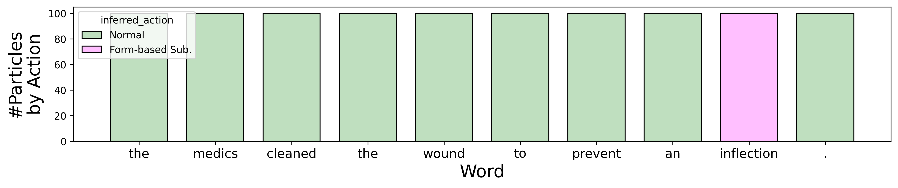
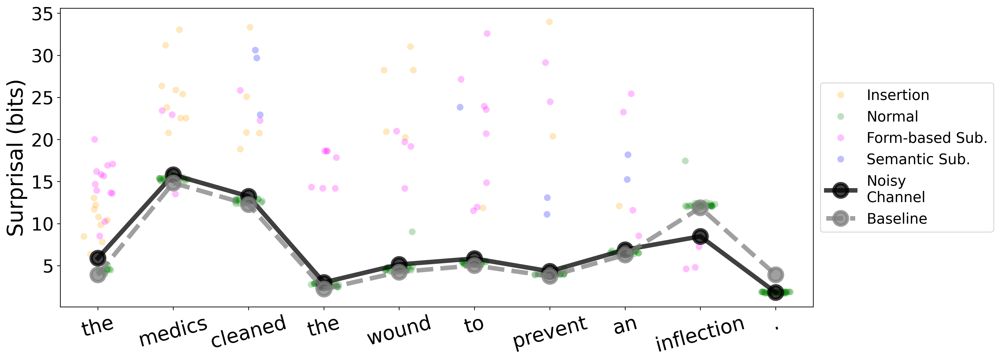
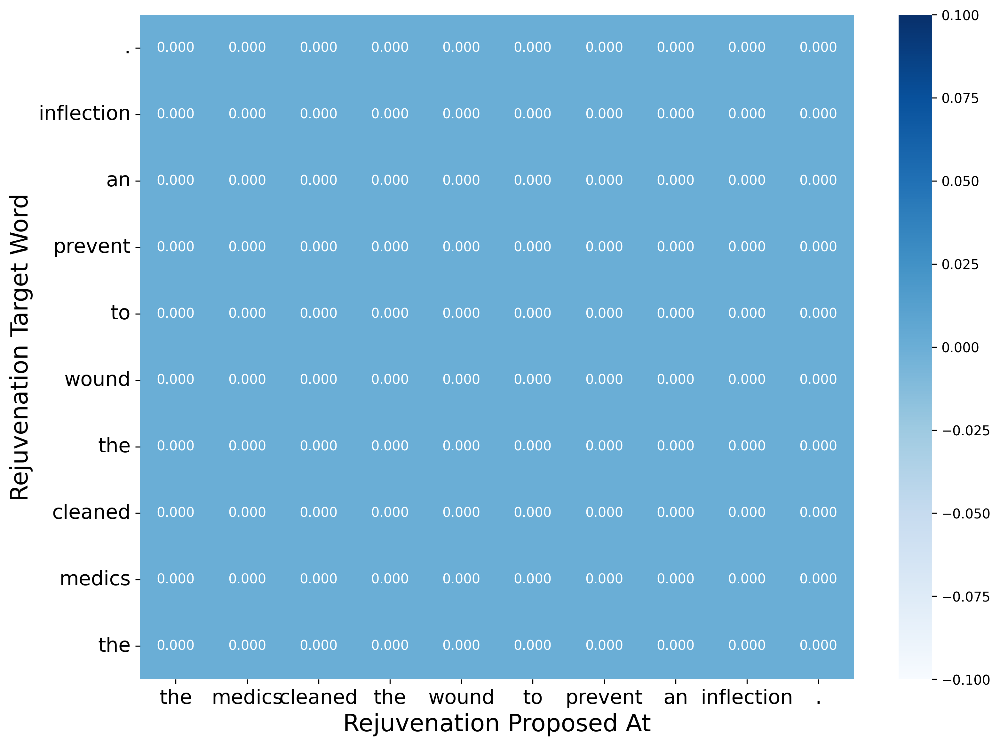

# Incremental and Approximate Noisy Channel Inference in Gen.jl

## Dependencies

Install Gen.jl: https://github.com/probcomp/Gen.jl

We also use the following Julia libraries:

```
StatsBase, Memoize, NNlib, Random, CSV, DataFrames, Distributions, KernelDensity, Distances, StringDistances, DelimitedFiles, Statistics, SortingAlgorithms, LinearAlgebra, Base.Threads, ArgParse
```

We have adapted code from hfppl/llamppl to help with language model queries: https://github.com/genlm/llamppl/tree/main

## Run inference on a sentence

```
julia gen_inference.jl --mode debug_one --debug_input "the boy licked the ball ."
```

## Run inference on a batch of sentences

```
julia gen_inference.jl --test_sents_file path/to/file.txt
```

The file argument should be a file with one sentence on each line. The punctuation tokens `[".", "!", "?", ","]` should be separated by whitespace from words, e.g. :

```
the boy licked the ball .
the mother gave the candle the daughter .
```

The default model vocabulary contains 5000 common English words, found in `data/gibson2013/dopo_to/vocab_augmented.txt`.

You may specify your own vocabulary file by supplying a file name to the `--vocab_file` command line argument.

## Visualize results of an inference run

```
# Use default arguments
python analyze_traces.py

# Custom arguments
python analyze_traces.py --base_dir .. --output_dir log/debug
```

This will produce plots like the following:

### Action posterior for each word in the sentence.



### Inferred sentence posterior.


### Surprisal.



### Rejuvenation acceptance at each word.


### Grid of rejuvenation acceptances by source and target (substitution proposal).


### Grid of rejuvenation acceptances by source and target (insert/skip proposal).



### 3D version showing the count of total rejuvenations.


## FAQ

### What error operations are included in the error model?

By default, the actions normal, sem_sub, phon_sub, insert, skip, and morph_sub are included. Two other operations, disfl and backtrack, are also included in the model but have not been robustly tested. You can specify the actions that you want to include in the error model as a command line argument:

```
julia gen_inference.jl --actions "normal,insert,phon_sub,sem_sub"
```

The insert action acts as a catch-all error in the custom proposal function (if there is no other way to make sense of an input, it can just be labeled an insertion error), so it is recommended that you minimally keep at least normal and insert.

You can also add your own new error functions by modifying the generative function and proposal function.

### How can I speed up inference?

You can use fewer particles, turn off one or both of the rejuvenation strategies, or limit the amount of computation spent on rejuvenation via the `--lookback`, `--logprob_thresh`, `--logprob_spread`, and `--second_pass_rejuv_p` arguments.

If you have access to a GPU, in theory the code can be modified to use autobatching, but this has not been implemented yet. Code contributions are welcome.
